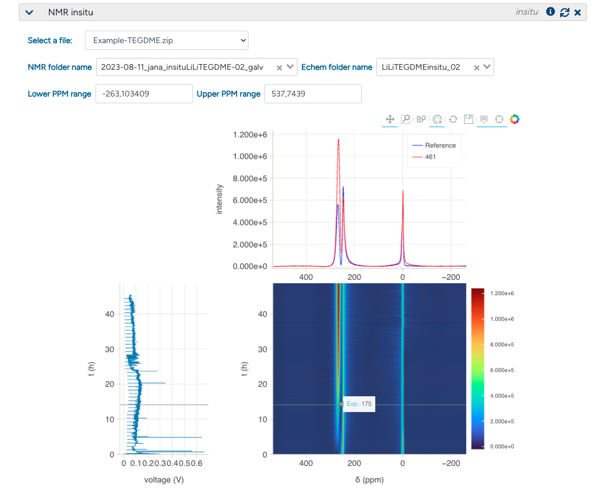

# <div align="center"><i>datalab insitu NMR</i></div>

<div align="center" style="padding-bottom: 5px">
<a href="https://demo.datalab-org.io"></a>
</div>

<div align="center">
<a href="https://join.slack.com/t/datalab-world/shared_invite/zt-2h58ev3pc-VV496~5je~QoT2TgFIwn4g"></a>
</div>

A Python plugin for processing and visualizing in situ NMR data within [_datalab_](https://github.com/the-grey-group/datalab) instances. This plugin leverages the [_datalab_ Python API](https://github.com/datalab-org/datalab-api) to create interactive Bokeh plots of NMR data alongside electrochemical measurements.

The project was originally developed in and is currently deployed for the [Grey Group](https://www.ch.cam.ac.uk/group/grey/) in the Department of Chemistry at the University of Cambridge.

## Features

- Process both 1D and pseudo-2D NMR data from Bruker instruments
- Integration with electrochemical data for combined analysis
- Interactive visualization using Bokeh
- Flexible PPM range selection



# Installation

We recommend you use [`uv`](https://astral.sh/uv) for managing virtual environments and Python versions.

Once you have `uv` installed, you can clone this repository and install the package in a fresh virtual environment with:

```
git clone git@github.com:datalab-org/datalab_app_plugin_nmr_insitu
cd datalab_app_plugin_nmr_insitu
uv sync --all-extras --dev
```

## Development installation

You can activate `pre-commit` in your local repository with `uv run pre-commit install`.

## Usage

### Basic Usage

```python
from datalab_api import DatalabClient
from datalab_app_plugin_nmr_insitu import process_data

# Initialize Datalab client
client = DatalabClient("https://your-datalab-instance.com")

# Process NMR data
result = process_data(
    api_url="https://your-datalab-instance.com",
    item_id="your-item-id",
    folder_name="your-folder",
    nmr_folder_name="nmr-data",
    echem_folder_name="echem-data",
    ppm1=240,
    ppm2=280
)
```

## API Reference

### Main Functions

#### process_data

```python
def process_data(
    api_url: str,
    item_id: str,
    folder_name: str,
    nmr_folder_name: str,
    echem_folder_name: str,
    ppm1: float,
    ppm2: float,
    start_at: int = 1,
    exclude_exp: Optional[List[int]] = None,
) -> Dict
```

Process NMR spectroscopy data from multiple experiments.

**Parameters:**

- `api_url`: URL of the Datalab API
- `item_id`: ID of the item to process
- `folder_name`: Base folder name
- `nmr_folder_name`: Folder containing NMR experiments
- `echem_folder_name`: Folder containing Echem data
- `ppm1`: Lower PPM range limit
- `ppm2`: Upper PPM range limit
- `start_at`: Starting experiment number (default: 1)
- `exclude_exp`: List of experiment numbers to exclude (default: None)

**Returns:**
Dictionary containing processed NMR and electrochemical data

```python
    result = {
        "metadata": {
            "ppm_range": {
                "start": nmr_data['ppm'].min(),
                "end": nmr_data['ppm'].max()
            },
            "time_range": {
                "start": df['time'].min(),
                "end": df['time'].max()
            },
            "num_experiments": num_experiments,
        },
        "nmr_spectra": {
            "ppm": nmr_data["ppm"].tolist(),
            "spectra": [
                {
                    "time": df["time"][i],
                    "intensity": nmr_data[str(i+1)].tolist()
                }
                for i in range(len(df))
            ]
        },
        "echem": {
            "Voltage": echem_df["Voltage"].tolist(),
            "time": (echem_df["time/s"] / 3600).tolist()
        }
    }
```

## License

This project is released under the conditions of the MIT license. Please see [LICENSE](https://github.com/datalab-org/datalab_app_plugin_nmr_insitu/blob/main/LICENSE) for the full text of the license.

## Contact

For questions and support, please [open an issue](https://github.com/datalab-org/datalab_app_plugin_nmr_insitu/issues) on the GitHub repository or join the [public datalab Slack workspace](https://join.slack.com/t/datalab-world/shared_invite/zt-2h58ev3pc-VV496~5je~QoT2TgFIwn4g).
